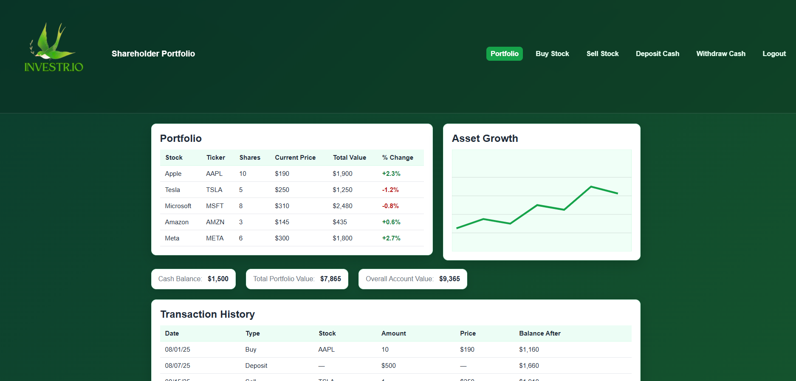
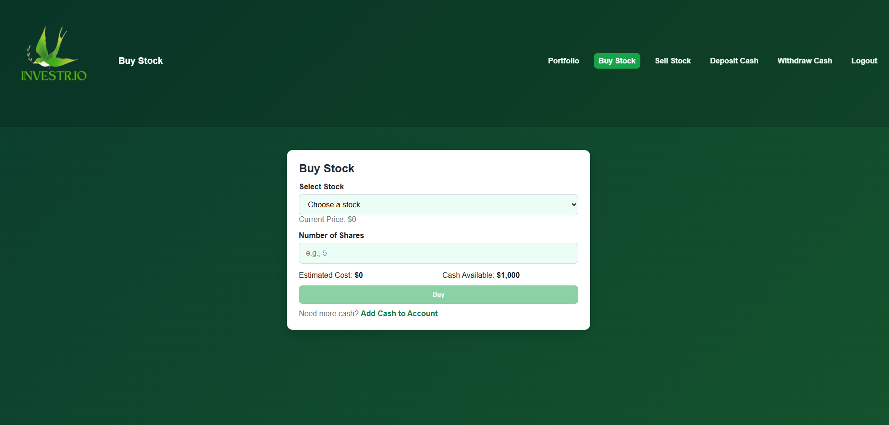
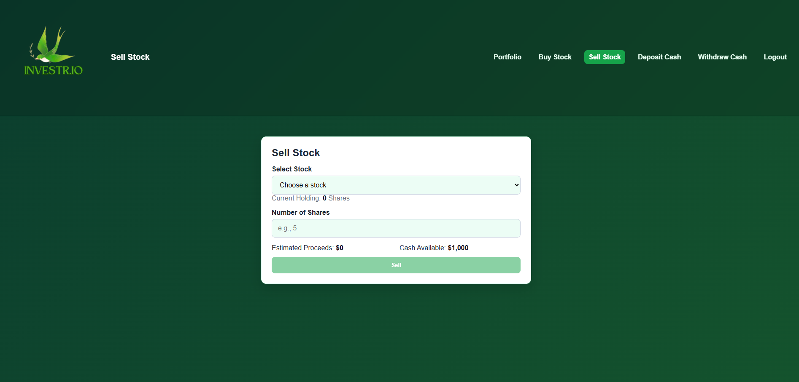
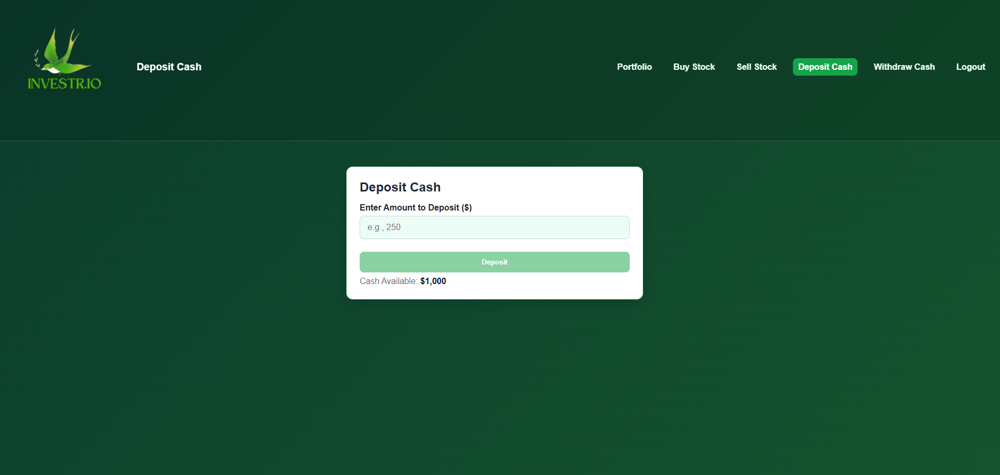
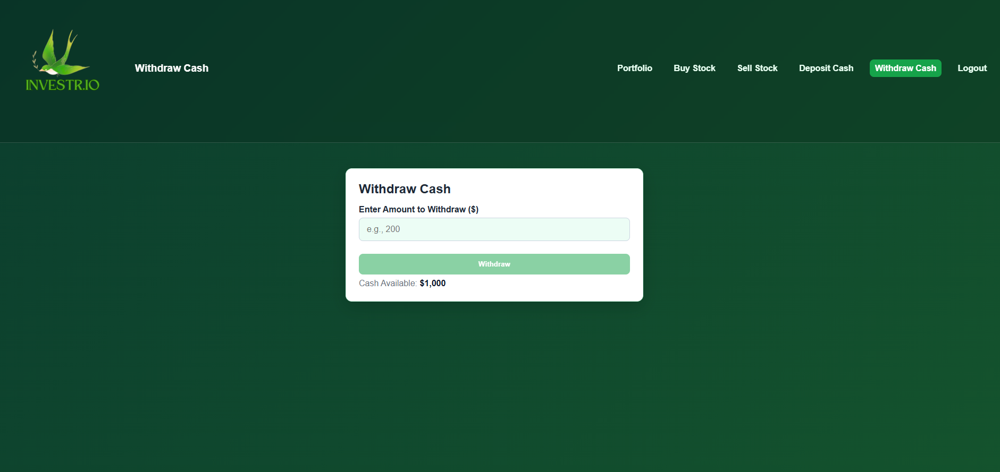
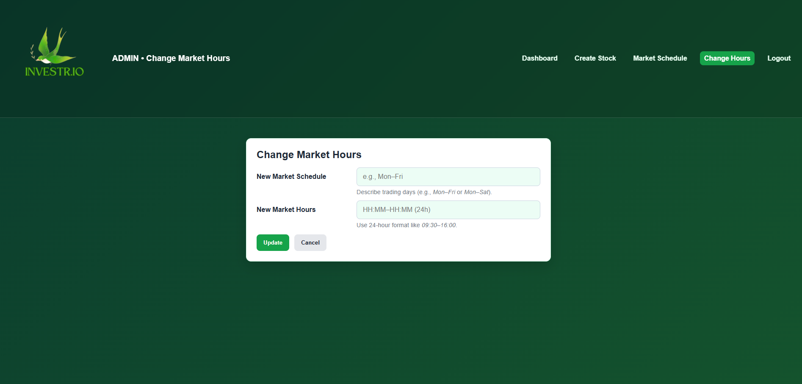
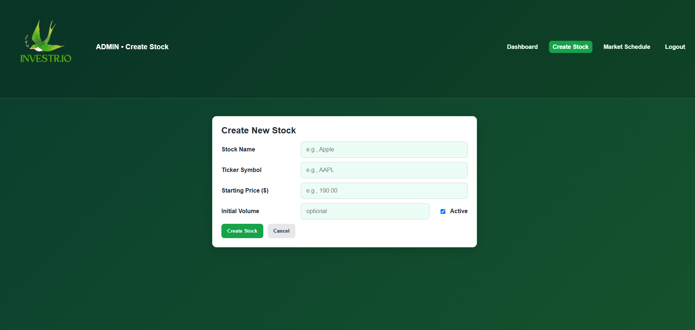

# IFT 401 Capstone – HTML & CSS

This repository contains the HTML and CSS pages I created for my IFT 401 Capstone project, *InvestR.io*.  
These files represent my individual front-end work (sign-in, dashboard, and related styles).

## Contents
- `sign_in.html`
- `dashboard.html`
- `portfolio.html`
- `css/portfolio.css`
- `images/` assets

## About the Project
The full project was a stock-trading simulation system built using Django for the backend.  
My contribution focused on front-end design and layout structure.

## Screenshots
### Sign-In Page

## Author
Summer Olson SRCARTE6 
Arizona State University